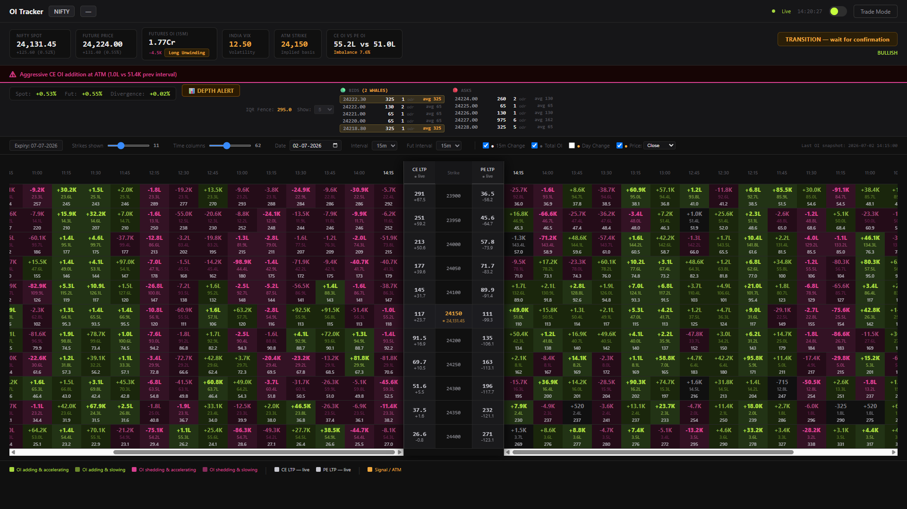

# OI Tracker v2.0 (Showcase)

> **⚠️ Note: Demo & Showcase Only**  
> This repository is strictly for showcasing the UI/UX and architecture of the Nexus OI dashboard. The original source code is maintained in a separate private repository: [oi-chain_NexusOI](https://github.com/nandhanreddy-p/oi-chain_NexusOI).  
>   
> For discussions, collaborations, or to request access to the source code repository, please contact me at: **pulagamsainandanreddy@gmail.com**.

OI Tracker is a highly responsive, real-time Options Open Interest (OI) tracking dashboard built for the Indian stock market (NIFTY, BANKNIFTY, FINNIFTY) using the Fyers API v3. It tracks options data, futures prices, and order book depth to provide traders with actionable, institutional-grade insights into market positioning.

The project features a lightweight Flask backend and an ultra-modern, reactive WebSocket-driven frontend.



## 🌟 Key Highlights

- **Live Market Tracking**: Real-time Last Traded Price (LTP) and Open Interest (OI) data via the Fyers API and WebSockets.
- **Visual OI Chain**: A dynamic, split-pane dashboard that maps out Call/Put OI additions and shedding across strikes. It uses intuitive color-coding (vivid greens for buildup, deep reds for shedding) to instantly highlight market trends.
- **Silent Activity & Whale Detection**: Actively monitors futures market depth to detect hidden institutional activity, tracking bid/ask "whales" and flagging critical divergences between Spot and Futures prices.
- **Smart Data Polling**: Optimized API usage that only takes database snapshots when meaningful changes in OI occur, effectively filtering out noise and preserving Fyers rate limits.
- **Historical Playback**: Navigatable timeframe windows (3m, 5m, 15m, 60m, etc.) to review historical OI buildup across the day.
- **Beautiful UI/UX**: Premium dual-theme dashboard (Light and Dark mode) utilizing micro-animations, glassmorphism elements, and reactive layouts.
- **Built-in Mock Mode**: Fully functional simulated data mode (`--mock`) for off-market hours testing and UI development without burning through API limits.

## 🛠️ Architecture & Tech Stack

- **Backend**: Python 3, Flask, Flask-SocketIO (with Gevent/Threading async mode).
- **Data Layer**: SQLite (`storage.py`) for persistent tracking of snapshots and LTP ticks.
- **Integration**: `fyers-apiv3` for REST calls (Option Chain snapshots) and WebSockets (live ticks & depth updates).
- **Frontend**: HTML5, Vanilla CSS (CSS Variables for themes), Vanilla JavaScript, and Socket.IO-client.

## 🚀 Getting Started

### Prerequisites
1. Python 3.8+
2. A valid [Fyers Developer Account](https://myapi.fyers.in/dashboard/).

### Installation

1. **Clone the repository:**
   ```bash
   git clone https://github.com/yourusername/fyers-oi-chain.git
   cd fyers-oi-chain
   ```

2. **Install dependencies:**
   ```bash
   pip install -r requirements.txt
   ```

3. **Configure API Keys:**
   Open `config.py` and input your Fyers credentials:
   ```python
   FYERS_APP_ID     = "YOUR_APP_ID"
   FYERS_SECRET_KEY = "YOUR_SECRET_KEY"
   FYERS_REDIRECT_URI = "https://trade.fyers.in/api-login/redirect-uri/index.html"
   ```

4. **Generate Access Token:**
   Every trading day, you need to generate a fresh token:
   ```bash
   python auth.py
   ```
   Follow the login prompt in your browser to save the token.

### Running the Application

**Live Mode (Market Hours):**
By default, the tracker runs on NIFTY50. You can specify different indices:
```bash
python main.py --symbol NIFTY
python main.py --symbol BANKNIFTY
python main.py --symbol FINNIFTY
```

**Mock Mode (Off-Market Testing):**
Want to see how the dashboard works on a weekend? Use mock mode to simulate a live market environment with generated ticks.
```bash
python main.py --mock
```

**Custom Port:**
```bash
python main.py --symbol BANKNIFTY --port 8080
```

Once running, the application will automatically launch your default web browser and navigate to `http://localhost:5000`.

## 📁 Project Structure

- `main.py`: Application entry point. Handles CLI arguments, initiates polling loops, and starts the web server.
- `config.py`: Centralized configuration (API keys, thresholds, intervals, symbols).
- `server.py`: Flask application and WebSocket (`Socket.IO`) event handlers.
- `fyers_client.py`: Wrapper for Fyers REST API and WebSocket connections.
- `storage.py`: SQLite database operations for persisting historical snapshots and LTPs.
- `analyzer.py` & `silent_detector.py`: Analytical engines for determining market bias (Long Buildup, Short Covering, etc.) and detecting order book anomalies.
- `templates/dashboard.html`: The frontend UI.

## 🤝 Contributing
Contributions, issues, and feature requests are welcome! 

## 📝 Copyright
Copyright (c) 2026 Sai Nandhan Reddy Pulagam. All Rights Reserved.

This project is showcased for portfolio and demonstration purposes only. No permission is granted to use, copy, modify, or distribute this code.
